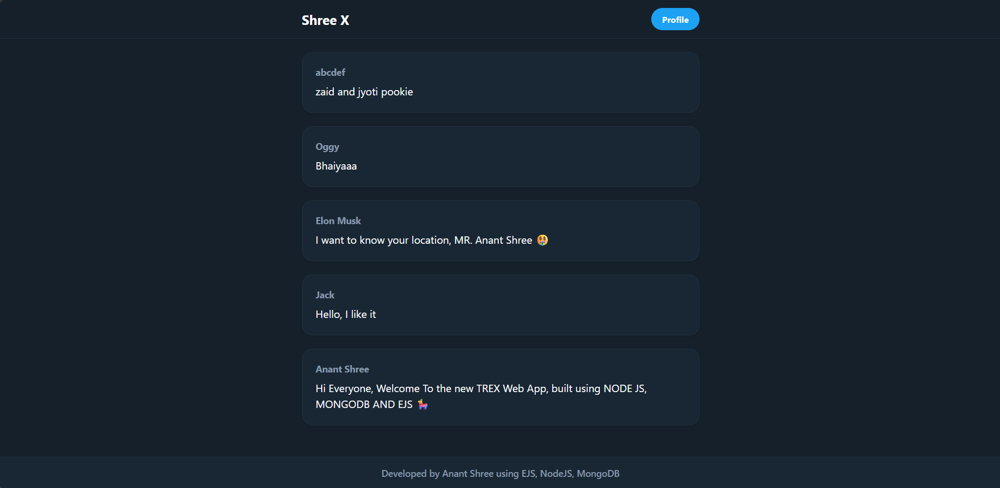

# Twitter Clone Backend

# My Project

## 🖼 Screenshot

## 🎬 Demo Video
<video src="trex.mp4" controls width="600"></video>

A simple backend application for a Twitter clone, built with Node.js, Express, and MongoDB.

## Features

- User Authentication (Registration, Login)
- Tweet creation and display
- Database connection using Mongoose and MongoDB Driver
- Session management

## Technologies Used

- Node.js
- Express.js
- MongoDB (via Mongoose and MongoClient)
- EJS (for views)
- dotenv (for environment variables)
- bcrypt/bcryptjs (for password hashing)
- express-session (for session management)

## Project Structure
